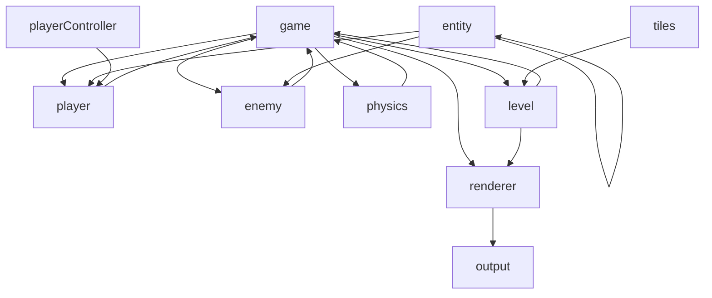
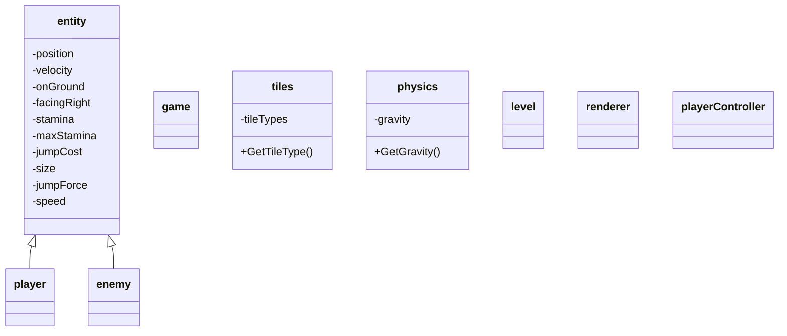

```mermaid
flowchart TD

game --> player
game --> renderer
game --> enemy
game -->physics
game --> level
player --> game
entity --> player
entity --> enemy
playerController --> player
physics --> game
tiles --> level
level --> renderer
level --> game
renderer --> output
enemy --> game
entity --> entity

%% Game is the model
%% Player is the controller
%% Renderer is the view
```

```mermaid
classDiagram
entity <|-- player
entity <|-- enemy

class game{
    
}
class player{

}
class entity{
    -position
    -velocity
    -onGround
    -facingRight
    -stamina
    -maxStamina
    -jumpCost
    -size
    -jumpForce
    -speed
}
class tiles{
    -tileTypes
    +GetTileType()

}
class physics{
    -gravity
    +GetGravity()
}
class level{

}
class enemy{

}
class renderer{

}
class playerController{

}
```