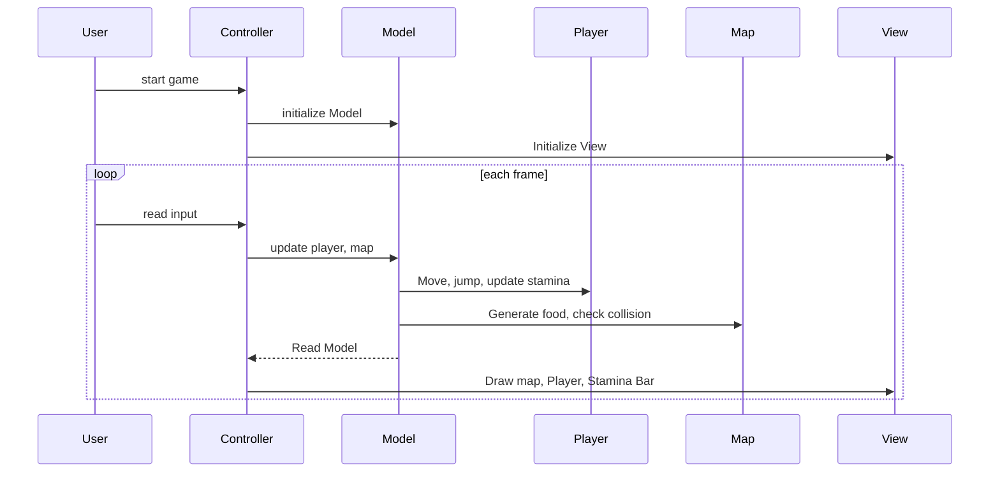
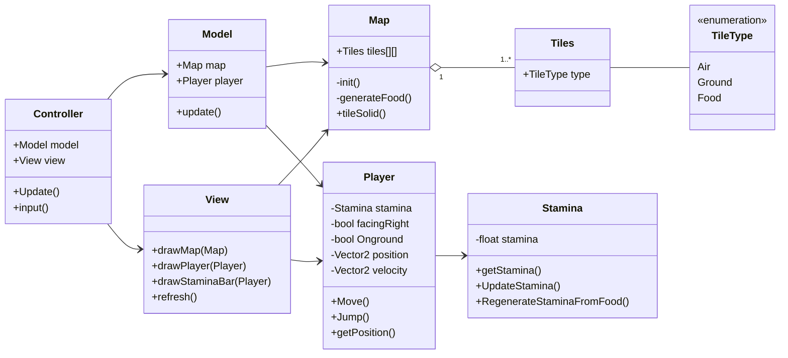

## Sequence Diagram

```mermaid
sequenceDiagram
participant User
participant Controller
participant Model
participant Player
participant Map
participant View

User ->> Controller: start game
Controller ->> Model: initialize Model
Controller ->> View: Initialize View

loop each frame
    User ->> Controller: read input
    Controller ->> Model: update player, map
    Model ->> Player: Move, jump, update stamina
    Model ->> Map: Generate food, check collision
    Model -->> Controller: Read Model
    Controller ->> View: Draw map, Player, Stamina Bar
    end
```

## Class Diagram

```mermaid
classDiagram
direction LR
Controller --> Model
Controller --> View
Model --> Map
Model --> Player
Map "1" o-- "1..*" Tiles
Tiles -- TileType
View --> Player
Player --> Stamina
View --> Map

class Controller {
    +Model model
    +View view
    +Update()
    +input()
}
class Model {
    +Map map
    +Player player
    +update()
}
class View {
    +drawMap(Map)
    +drawPlayer(Player)
    +drawStaminaBar(Player)
    +refresh()
}
class Player {
    -Stamina stamina
    -bool facingRight
    -bool Onground
    -Vector2 position
    -Vector2 velocity
    +Move()
    +Jump()
    +getPosition()
}
class Stamina {
    -float stamina
    +getStamina()
    +UpdateStamina()
    +RegenerateStaminaFromFood()
}
class Map {
    +Tiles tiles[][]

    -init()
    -generateFood()
    +tileSolid()
}
class Tiles {
    +TileType type
}
class TileType <<enumeration>> {
    Air
    Ground
    Food
}
```
